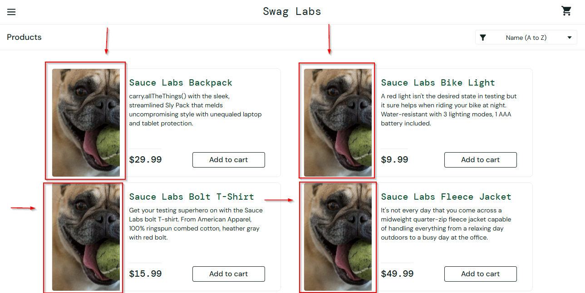

# Bug Report: BUG-001

**Bug ID:** BUG-001  
**Title:** Wrong Product Images for problem_user  
**Reported By:** Mohammad Murtuza Moin  
**Date:** 04-May-2026  

### Environment:
**URL:** https://www.saucedemo.com  
**Browser:** Microsoft Edge Version 147.0.3912.86 (64-bit)  
**OS:** Windows 10 Pro (22H2)  
**User:** problem_user  

**Severity:** Medium  
**Priority:** P1  
**Status:** Open  

### Steps to Reproduce:
1. Open Microsoft Edge browser
2. Go to the website, https://www.saucedemo.com
3. Enter problem_user in the username field and secret_sauce in the password field
4. Click on Login button

**Expected Behavior:**  
User will be redirected to the products listing page after successful login and products lists along with their correct names and images will be visible.

**Actual Behavior:**  
All products have the same image that consist of a dog instead of the correct product images according to their names and little description.

### Screenshot:

