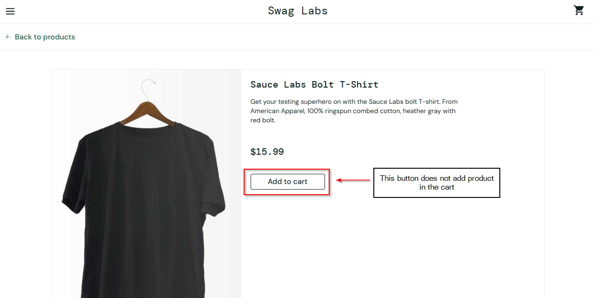

# Bug Report: BUG-002

**Bug ID:** BUG-002  
**Title:** Add to Cart button broken on product detail page for problem_user  
**Reported By:** Mohammad Murtuza Moin  
**Date:** 04-May-2026  

### Environment:
**URL:** https://www.saucedemo.com  
**Browser:** Microsoft Edge Version 147.0.3912.86 (64-bit)  
**OS:** Windows 10 Pro (22H2)  
**User:** problem_user  

**Severity:** High  
**Priority:** P2  
**Status:** Open  

### Steps to Reproduce:
1. Open Microsoft Edge browser
2. Go to the website: https://www.saucedemo.com
3. Enter problem_user in the username field and secret_sauce in the password field
4. Click on Login button
5. Click on any product that you want to add to cart
6. Click on Add to Cart button
  
**Expected Behavior:**  
User will have the product in the cart after clicking on Add to Cart button on the product detail page.

**Actual Behavior:**  
Add to Cart button does not add the product in the cart, the cart badge doesn’t update upon clicking and the button still shows Add to Cart instead of remove button.

### Screenshot:
