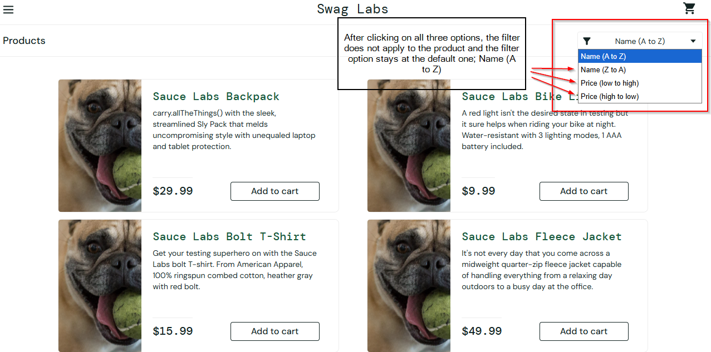

# Bug Report: BUG-003

**Bug ID:** BUG-003  
**Title:** Sort filter broken for problem_user  
**Reported By:** Mohammad Murtuza Moin  
**Date:** 04-May-2026  

### Environment:
**URL:** https://www.saucedemo.com  
**Browser:** Microsoft Edge Version 147.0.3912.86 (64-bit)  
**OS:** Windows 10 Pro (22H2)  
**User:** problem_user  

**Severity:** Low  
**Priority:** P3  
**Status:** Open  

### Steps to Reproduce:
1. Open Microsoft Edge browser
2. Go to the website, https://www.saucedemo.com
3. Enter problem_user in the username field and secret_sauce in the password field
4. Click on Login button
5. Click on Sort filter button which is located below the cart icon
6. Select any option from the filter

**Expected Behavior:**  
User will be able to see the result based on the selected option in the sort filter.
For example, if a user selected the filter Price (low to high), the product lists will change the order by price range starting from lowest price product to highest.

**Actual Behavior:**  
The filter option stays at the default option which is Name (A to Z), and does not change upon clicking no matter what option you select.

### Screenshot:  
