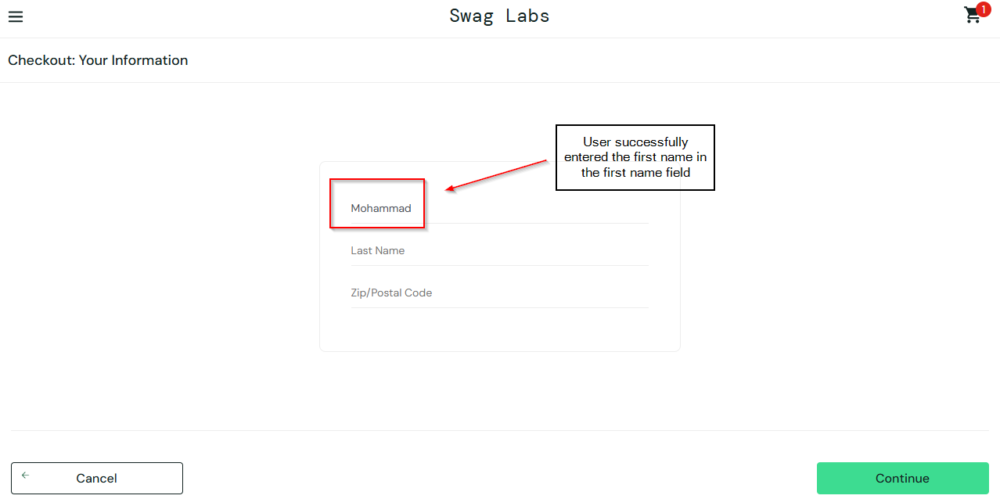
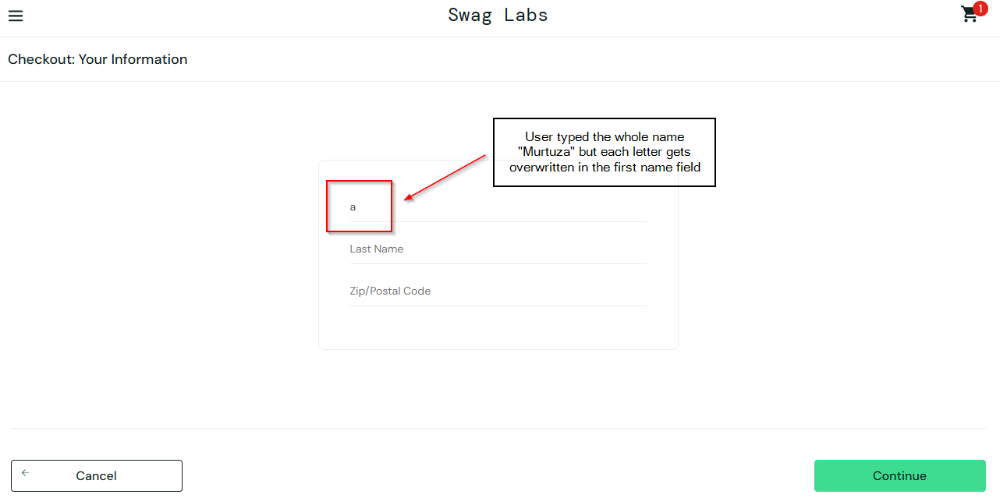

# Bug Report: BUG-004

**Bug ID:** BUG-004  
**Title:** Last Name field broken in the checkout page for problem_user  
**Reported By:** Mohammad Murtuza Moin  
**Date:** 04-May-2026  

### Environment:
**URL:** https://www.saucedemo.com  
**Browser:** Microsoft Edge Version 147.0.3912.86 (64-bit)  
**OS:** Windows 10 Pro (22H2)  
**User:** problem_user  

**Severity:** High  
**Priority:** P1  
**Status:** Open  

### Steps to Reproduce:
1. Open Microsoft Edge browser
2. Go to the website, https://www.saucedemo.com
3. Enter problem_user in the username field and secret_sauce in the password field
4. Click on Login button
5. Click on Add to Cart button on any product
6. Click on the cart icon
7. Click on Checkout button
8. Enter info in the First Name field
9. Enter info in the Last Name field

**Expected Behavior:**  
User will be able to enter the information in both First Name and Last Name fields and will be able to see the characters they entered

**Actual Behavior:**  
User is able to enter the first name field successfully but as soon as user typed something in the last name field, the first name field gets overwritten by a single letter that was typed by the user and the first name field shows only that specific letter that was typed at last.

**Related Test Case:** TC-029  

### Screenshots:
**First Screenshot shows when user entered info in the first name field.**

**The second screenshot is taken after the user tried to enter info in the last name field.**

