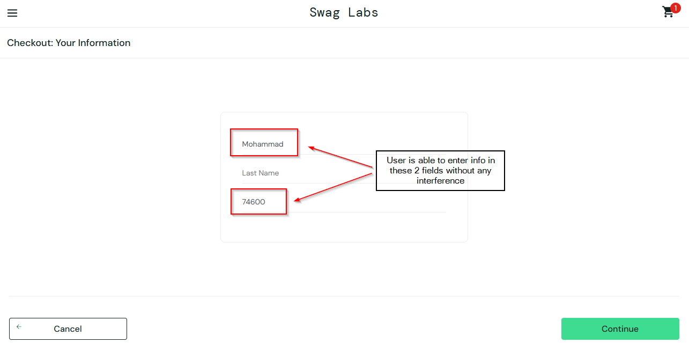
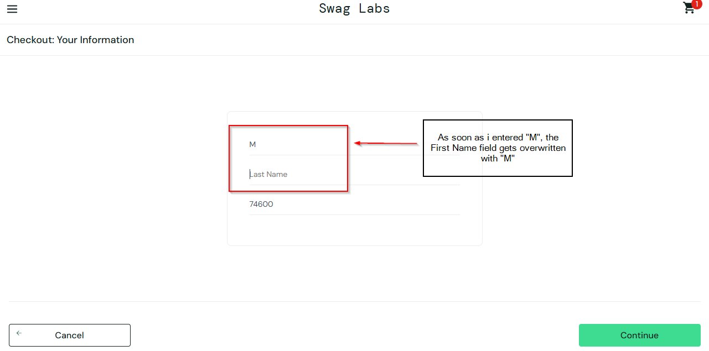

# Bug Report: BUG-005

**Bug ID:** BUG-005  
**Title:** Checkout cannot be completed due to field overwriting bug for problem_user  
**Reported By:** Mohammad Murtuza Moin  
**Date:** 04-May-2026  

### Environment:
**URL:** https://www.saucedemo.com  
**Browser:** Microsoft Edge Version 147.0.3912.86 (64-bit)  
**OS:** Windows 10 Pro (22H2)  
**User:** problem_user  

**Severity:** Critical  
**Priority:** P1  
**Status:** Open  

### Steps to Reproduce:
1. Open Microsoft Edge browser
2. Go to the website, https://www.saucedemo.com
3. Enter problem_user in the username field and secret_sauce in the password field
4. Click on Login button
5. Click on Add to Cart button on any product
6. Click on the cart icon
7. Click on Checkout button
8. Enter info in the First Name field
9. Enter info in the Last Name field
10. Enter info in the Zip/Postal Code field
11. Click on Continue button

**Expected Behavior:**  
User will be able to reach to the overview page after entering info in all 3 fields and completing the checkout.

**Actual Behavior:**  
User is able to enter info in the first name field and zip/postal code field but stuck in the checkout page due to overwriting of letters in the first name field when last name field gets any input, hence user cannot proceed further.

**Related Test Case:** TC-029

### Screenshots:
**First Screenshot is taken before entering info in the Last Name field.**

**The second screenshot is taken after entering info in the Last Name field.**
